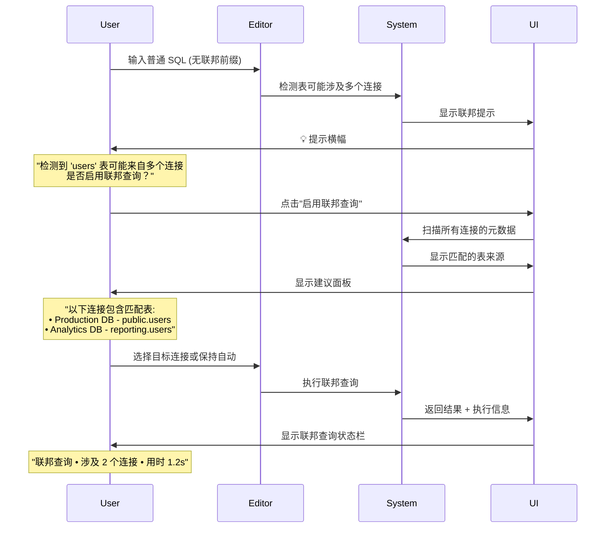
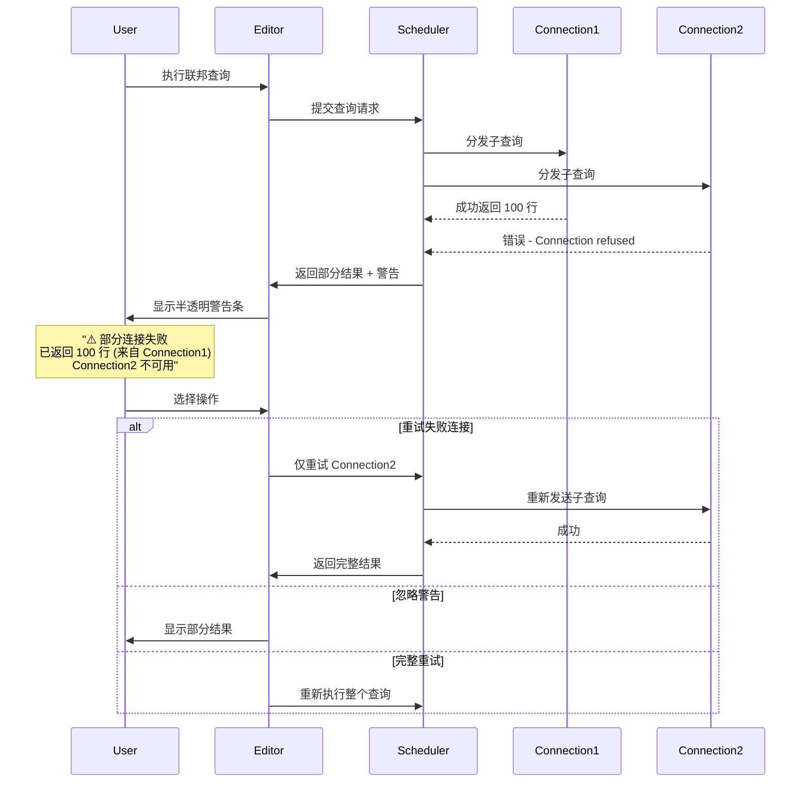

# dbx 联邦查询与 SQL 格式化 - UI/UX 优化设计方案（架构评审修订版）

**版本**: 2.0  
**角色**: UI 设计师 / UX 架构师  
**日期**: 2026-07-31  

---

## 一、设计原则（基于架构评审修正）

### 1.1 核心原则

| 原则 | 说明 | 影响 |
|------|------|------|
| **透明性** | 联邦查询对用户透明，无需手动输入连接前缀 | 简化用户操作流程 |
| **即时反馈** | 任何操作都有明确的视觉反馈 | 降低认知负担 |
| **容错友好** | 错误时提供清晰的恢复路径 | 减少挫败感 |
| **渐进披露** | 高级功能按需展开，避免界面拥挤 | 保持界面简洁 |
| **一致性** | 与 dbx 现有设计语言保持一致 | 降低学习成本 |

### 1.2 联邦查询的正确交互模型

**❌ 错误的体验**（用户需手动输入前缀）：
```
用户: SELECT * FROM conn1.public.users;
→ 心智负担高，容易出错
```

**✅ 正确的体验**（后端自动识别分发）：
```
用户: SELECT * FROM users;
→ 后端自动路由到正确连接
```

---

## 二、连接树联邦状态指示器（修订版）

### 2.1 视觉状态定义

```
┌─────────────────────────────────────────────────────────────────────┐
│  📁 Connections                                                     │
├─────────────────────────────────────────────────────────────────────┤
│                                                                     │
│  🔵 🔄 Production DB (PostgreSQL)                               │  ← 联邦已启用
│     ├─ 💬 public                                                    │
│     └─ 💬 sales                                                     │
│                                                                     │
│  🟢 [ ] Dev Database (MySQL)                                      │  ← 未启用联邦
│     └─ 💬 shop                                                      │
│                                                                     │
│  ⚪ Local SQLite                                                  │  ← 不支持联邦
│     └─ (无联邦选项)                                                 │
│                                                                     │
└─────────────────────────────────────────────────────────────────────┘
```

### 2.2 图标语义

| 图标 | 状态 | 颜色 | 鼠标悬停提示 |
|------|------|------|-------------|
| 🔄 + 🔵 | 联邦已启用 | Blue (#1E90FF) | "联邦查询已启用" |
| ✗ + 🟢 | 联邦已禁用 | Orange (#FFA500) | "右键启用联邦查询" |
| — + ⚪ | 不支持联邦 | Gray (#888) | "此数据库类型不支持联邦查询" |
| 🟡 | 联邦配置中 | Yellow (#FFD700) | "正在验证联邦配置..." |

### 2.3 右键菜单扩展

```
┌─────────────────────────────────────────────┐
│ 🔵 Production DB                           │
├─────────────────────────────────────────────┤
│ 📋 打开连接                                │
│ 🔍 搜索对象                                │
│ ───────────────────────────────────────── │
│ 🔄 启用联邦查询         ← 新增             │
│ ⚙️  联邦配置...           ← 新增           │
│ ───────────────────────────────────────── │
│ ✏️  重命名                              │
│ 🗑️  删除连接                            │
└─────────────────────────────────────────────┘
```

---

## 三、SQL 编辑器联邦感知增强（修订版）

### 3.1 智能补全系统

当用户开始输入表名时，系统自动推断可能涉及的联邦连接：

```
用户在编辑器输入:
SELECT * FROM us          ← 光标在此处

┌──────────────────────────────────────────┐
│ 🤖 智能建议                              │
├──────────────────────────────────────────┤
│ 🔵 users (Production DB - PostgreSQL)    │
│    public.users  · 约 1,245,678 行      │
│                                          │
│ 🟢 customers (Dev Database - MySQL)      │
│    shop.customers  · 约 50,000 行       │
│                                          │
│ ... 还有 5 个相关表                      │
└──────────────────────────────────────────┘
```

**交互细节**：
- 联邦连接名称前有 🔵 蓝色圆点标识
- 显示来源数据库类型和行数估算
- Tab 键接受建议，Enter 键查看详细信息

### 3.2 联邦表悬停提示

```
鼠标悬停在 users 表名上时：

┌──────────────────────────────────────────────────┐
│  users                                           │
│  ────────────────────────────────────────────── │
│  类型: Table                                     │
│  来源: Production DB (PostgreSQL)               │
│  模式: public                                    │
│  行数: ~1,245,678                                │
│  最后更新: 2026-07-31 14:23                      │
│                                                  │
│  [📊 查看数据]  [📐 结构详情]  [⚡ 快速查询]     │
└──────────────────────────────────────────────────┘
```

**触发条件**：
- 光标位于已识别的联邦表引用上
- 或表中包含联邦查询关键字

### 3.3 联邦查询执行信息栏

**位置**: 结果面板顶部，联邦查询后显示

```
┌─────────────────────────────────────────────────────────────────────────┐
│ 🌐 联邦查询                                                             │
│ 涉及连接: conn1(PostgreSQL) · conn2(MySQL)   ⏱️ 用时: 2.34s            │
│ 扫描: 10,245 行 · 返回: 1,245 行 · 合并耗时: 45ms                      │
│                                                                         │
│ [📊 查看详细计划]  [⚠️ 部分失败 (重试)]                                 │
└─────────────────────────────────────────────────────────────────────────┘
```

**点击"查看详细计划"展开**：

```
┌─────────────────────────────────────────────────────────────────────────┐
│ 查询执行计划                                                            │
├──────────────┬────────────┬──────────────┬─────────────┬───────────────┤
│ 连接         │ 执行的 SQL │ 耗时         │ 返回行数    │ 状态          │
├──────────────┼────────────┼──────────────┼─────────────┼───────────────┤
│ conn1        │ SELECT ... │ 1.2s         │ 5,123       │ ✅ 成功       │
│ conn2        │ SELECT ... │ 0.8s         │ 8,901       │ ✅ 成功       │
│ conn3        │ SELECT ... │ 超时         │ -           │ ❌ 失败       │
└──────────────┴────────────┴──────────────┴─────────────┴───────────────┘
[复制计划]  [关闭]
```

---

## 四、SQL 格式化控制面板（修订版）

### 4.1 主控制面板

```
┌─────────────────────────────────────────────────────────────────────┐
│ 🎨 SQL Formatter        [⚙️]  自动保存: [✓]                   [-X] │
├─────────────────────────────────────────────────────────────────────┤
│                                                                     │
│  关键字大小写:    [▼ upper ▼]                                       │
│  标识符大小写:    [▼ preserve ▼]                                     │
│  函数大小写:      [▼ preserve ▼]                                     │
│  缩进样式:        [▼ standard ▼]                                     │
│                                                                     │
│  Tab 宽度:        [  2  ] ─────●───── [8]                          │
│  语句间空行:      [  1  ] ─────●───── [5]                          │
│                                                                     │
│  ───────────────────────────────────────────────────────────────  │
│                                                                     │
│  ☑ 启用联邦查询感知格式化                                         │
│  ☑ 保留表别名原样                                                │
│  ☑ 自动检测方言                                                   │
│                                                                     │
│                          [应用格式 (⌘⇧F)]  [重置]  [JSON 配置]    │
│                                                                     │
│  ┌─ 格式化预览 ─────────────────────────────────────────────────┐  │
│  │ Before:          After:                                      │  │
│  │ select * from      SELECT *                                   │  │
│  │   users;           FROM users;                                │  │
│  │                        WHERE id > 10;                         │  │
│  └───────────────────────────────────────────────────────────────┘  │
│                                                                     │
└─────────────────────────────────────────────────────────────────────┘
```

### 4.2 JSON 高级配置对话框

```
┌─────────────────────────────────────────────────────────────────────┐
│ 高级 JSON 配置                                                    │
├─────────────────────────────────────────────────────────────────────┤
│                                                                     │
│  ┌─────────────────────────────────────────────────────────────┐   │
│  │ {                                                          │   │
│  │   "version": 1,                                            │   │
│  │   "formatter": "sql-formatter",                            │   │
│  │   "name": "DBX Default",                                   │   │
│  │   "options": {                                             │   │
│  │     "keywordCase": "upper",                                │   │
│  │     "identifierCase": "preserve",                          │   │
│  │     ...                                                    │   │
│  │   },                                                       │   │
│  │   "federated": {                                           │   │
│  │     "enabled": true,                                       │   │
│  │     "preservePrefix": true,                                │   │
│  │     "aliasStyle": "AS"                                     │   │
│  │   }                                                        │   │
│  │ }                                                          │   │
│  └─────────────────────────────────────────────────────────────┘   │
│                                                                     │
│  [✅ Validate JSON]  [📥 Import]  [📤 Export]                       │
│                                                                     │
│                 [帮助文档]  [取消]  [应用并格式化]                  │
└─────────────────────────────────────────────────────────────────────┘
```

### 4.3 工具栏快捷按钮

**位置**: QueryEditor 顶部工具栏

```
┌─────────────────────────────────────────────────────────────────────┐
│ [💾 Save]  [▶ Execute]  [↓ New Tab]  [⟳ Refresh]  [🎨 Format ⌘⇧F] │
│                                                                     │
│                        ↑                                             │
│              联邦查询模式按钮（仅在联邦查询激活时显示）              │
│                                                                     │
│  [🌐 Federated]  [📊 Explain]  [⏱️ Timeout: 30s ▼]                │
└─────────────────────────────────────────────────────────────────────┘
```

**联邦查询模式按钮行为**：
- 单击：切换联邦查询模式（普通 ↔ 联邦）
- 长按：打开联邦连接选择器
- 悬停：显示当前激活的联邦连接列表

---

## 五、联邦配置管理对话框

```
┌─────────────────────────────────────────────────────────────────────┐
│ 联邦配置: Production DB                                            │
├─────────────────────────────────────────────────────────────────────┤
│                                                                     │
│  ┌─ 基础设置 ──────────────────────────────────────────────────┐   │
│  │ ☑ 允许参与联邦查询                                          │   │
│  │                                                              │   │
│  │ 联邦目录前缀: [conn1              ]  (自动使用连接名)       │   │
│  │            [验证] [默认]  帮助 ❓                           │   │
│  └──────────────────────────────────────────────────────────────┘   │
│                                                                     │
│  ┌─ Schema 可见性 ─────────────────────────────────────────────┐   │
│  │ ☑ 暴露所有模式                                              │   │
│  │                                                              │   │
│  │ 可见模式:                                                    │   │
│  │ ┌────────────────────────────────────────────────────────┐   │   │
│  │ │ ☐ admin          (受保护)                              │   │   │
│  │ │ ☑ public         (已选中)                              │   │   │
│  │ │ ☑ sales                                                   │   │   │
│  │ │ ─────────────────────────────────────────────────────  │   │   │
│  │ │ [+ 添加模式]                                            │   │   │
│  │ └────────────────────────────────────────────────────────┘   │   │
│  └──────────────────────────────────────────────────────────────┘   │
│                                                                     │
│  ┌─ 安全设置 ──────────────────────────────────────────────────┐   │
│  │ 排除模式:    [public,sales        ]                         │   │
│  │ 排除表:      [admin_users,audit_log ]                       │   │
│  │ 最大返回行数: [  10000         ]                             │   │
│  │ 查询超时:    [  30           ] seconds                      │   │
│  └──────────────────────────────────────────────────────────────┘   │
│                                                                     │
│                     [取消]                    [确定]                │
└─────────────────────────────────────────────────────────────────────┘
```

---

## 六、UX 流程设计（修订版）

### 6.1 首次使用联邦查询引导流程



### 6.2 SQL 格式化工作流

```mermaid
graph TD
    A[用户在编辑器中输入 SQL] --> B{触发格式化?}
    B -- 快捷键 ⌘⇧F --> C[获取格式化配置]
    B -- 工具栏按钮 --> C
    B -- 自动保存开启 --> D[后台异步格式化]
    
    C --> E[调用 FormatterService.format()]
    E --> F{格式化成功?}
    F -- 是 --> G[替换编辑器内容]
    F -- 否 --> H[显示错误提示]
    
    G --> I[恢复光标位置]
    H --> J[显示可选操作]
    
    J --> K{用户选择}
    K -- 查看配置 --> L[打开格式化面板]
    K -- 恢复默认 --> M[重置配置并重试]
    K -- 忽略 --> N[保持原状]
    
    style H fill:#ffebee,stroke:#c62828
    style G fill:#e8f5e9,stroke:#2e7d32
```

### 6.3 联邦查询错误处理流程



---

## 七、视觉风格指南（修订版）

### 7.1 颜色方案

| 用途 | Light Mode | Dark Mode | 对比度 |
|------|-----------|-----------|--------|
| 联邦成功 | `#1E90FF` (DodgerBlue) | `#64B5F6` | AAA |
| 联邦待配置 | `#FFA500` (Orange) | `#FFB74D` | AA |
| 联邦错误 | `#DC143C` (Crimson) | `#EF5350` | AAA |
| 格式化成功 | `#32CD32` (LimeGreen) | `#81C784` | AA |
| 联邦统计文字 | `#555555` | `#AAAAAA` | - |
| 面板背景 | `#FAFAFA` | `#1E1E1E` | - |
| 边框线条 | `#E0E0E0` | `#333333` | - |

### 7.2 图标规范

使用 Lucide Vue 图标库，联邦查询专用图标：

| 图标 | 用途 | 尺寸 |
|------|------|------|
| `Database2` | 联邦连接列表项 | 16px |
| `Network` | 联邦查询执行图标 | 14px |
| `PencilRuler` | 格式化按钮 | 14px |
| `RefreshCw` | 刷新/重试 | 12px |
| `AlertCircle` | 警告提示 | 16px |
| `CheckCircle2` | 成功状态 | 14px |
| `XCircle` | 失败状态 | 14px |

### 7.3 动效规范

| 场景 | 动画 | 持续时间 |
|------|------|---------|
| 联邦连接启用 | 图标从灰色渐变为蓝色 + 缩放 | 300ms |
| 格式化应用 | 内容淡入淡出 | 200ms |
| 加载状态 | 旋转 spinner | 无限循环 |
| 错误提示 | 红色抖动效果 | 500ms |
| 结果展开 | 平滑高度过渡 | 250ms |

---

## 八、响应式适配

### 8.1 不同屏幕尺寸布局

| 断点 | 布局调整 |
|------|---------|
| >1400px | 侧边栏常驻，格式化面板折叠在右侧 |
| 1000-1400px | 侧边栏可收起，格式化面板移至底部抽屉 |
| <1000px | 侧边栏全屏覆盖，格式化面板为模态对话框 |

### 8.2 暗黑模式适配

确保所有联邦相关元素在暗黑模式下有合适的视觉层次：

```css
/* Light mode */
.federation-enabled { color: #1E90FF; }
.federation-warning { background: #FFF3E0; border-color: #FF9800; }

/* Dark mode */
.federation-enabled { color: #64B5F6; }
.federation-warning { background: #3E2723; border-color: #FF9800; }
```

---

## 九、无障碍设计（修订版）

### 9.1 键盘导航

| 操作 | Windows/Linux | macOS | 描述 |
|------|--------------|-------|------|
| 打开格式化面板 | `Alt+Shift+F` | `Option+Cmd+F` | Focus formatter panel |
| 触发格式化 | `Ctrl+Shift+F` | `Cmd+Shift+F` | Primary action |
| 切换联邦模式 | `Ctrl+Shift+N` | `Cmd+Shift+N` | Toggle federation |
| 重试失败连接 | `Enter` (焦点在警告时) | 同上 | Retry failed connection |
| 关闭对话框 | `Escape` | 同上 | Close dialog |

### 9.2 ARIA 标签

```html
<!-- 联邦状态图标 -->
<span 
  role="img" 
  aria-label="联邦查询已启用"
  class="federation-badge enabled"
>
  <Database2 size="12" />
</span>

<!-- 格式化按钮 -->
<button 
  aria-label="格式化 SQL (Ctrl+Shift+F)"
  aria-controls="formatter-panel"
  class="format-btn"
>
  <PencilRuler />
</button>

<!-- 联邦查询状态栏 -->
<div 
  role="status" 
  aria-live="polite"
  class="federation-status-bar"
>
  联邦查询完成 • 涉及 2 个连接
</div>
```

---

## 十、原型示意（Wireframe Concepts）

### 10.1 QueryEditor 联邦查询状态

```
┌─────────────────────────────────────────────────────────────────────────┐
│ [💾 保存]  [▶ 执行]  [↓ 新标签]  [↻ 刷新]  [🎨 格式化 ⌘⇧F]            │
├─────────────────────────────────────────────────────────────────────────┤
│  [连接: Production DB ▼]  [方言: Auto ▼]  [🌐 联邦查询]               │
├─────────────────────────────────────────────────────────────────────────┤
│                                                                         │
│  SELECT                                                                 │
│    u.name,                                                              │
│    o.order_date,                                                        │
│    p.product_name                                                       │
│  FROM                                                                   │
│    users AS u                                                          ════════← 联邦连接 Detection  │
│    JOIN orders AS o ON u.id = o.user_id                               │
│    JOIN products AS p ON o.product_id = p.id                          │
│  WHERE                                                                  │
│    o.status = 'completed'                                              │
│  ORDER BY                                                               │
│    o.order_date DESC                                                    │
│                                                                         │
├─────────────────────────────────────────────────────────────────────────┤
│ 🌐 联邦查询 • 涉及: conn1, conn2 • ⏱️ 用时: 1.8s • Rows: 42           │
└─────────────────────────────────────────────────────────────────────────┘
```

### 10.2 格式化面板展开状态

```
┌─────────────────────────────────────────────────────────────────────────┐
│ SQL Editor                                                               │
│ ┌─────────────────────────────────────────────────────────────────┐    │
│ │ SELECT u.name, o.order_date...                                   │    │
│ │ ... (大量格式化后的 SQL)                                        │    │
│ └─────────────────────────────────────────────────────────────────┘    │
│                                                                       │
│ ════════════════════════════════════════════════════════════════════  │
│ 🎨 SQL Formatter  [⚙️] [-X]                                           │
│ ├─ Keyword Case: [▼ upper ▼]                                          │
│ ├─ Identifier:  [▼ preserve ▼]                                        │
│ ├─ Function:    [▼ preserve ▼]                                        │
│ ├─ Indent Style:[▼ standard ▼]                                        │
│ │                                                                      │
│ │ [应用格式]  [重置默认]  [JSON 配置]                                  │
│ │                                                                      │
│ │ [▼ 预览对比]                                                        │
│ │ Before:          After:                                             │
│ │ ┌──────────┐   ┌──────────┐                                         │
│ │ │select *  │   │SELECT *  │                                         │
│ │ │from users│   │FROM users│                                         │
│ │ └──────────┘   └──────────┘                                         │
│ └─────────────────────────────────────────────────────────────────────┘
└─────────────────────────────────────────────────────────────────────────┘
```

---

## 十一、实施优先级

| 优先级 | 功能模块 | 预计工时 | 理由 |
|--------|---------|---------|------|
| P0 | 联邦连接状态图标 + API 对接 | 3天 | 基础可用 |
| P0 | 格式化控制面板基础版 | 2天 | 核心功能 |
| P1 | 智能补全系统 | 4天 | 提升体验 |
| P1 | 联邦查询执行信息栏 | 3天 | 可视化反馈 |
| P2 | 格式化预览对比 | 2天 | 增强便利 |
| P2 | 联邦关系图可视化 | 5天 | 高级功能 |

---

*本 UI/UX 设计文档与架构评审版设计文档配合使用，所有交互设计均已考虑技术可行性。实施时请优先完成 P0 级别功能，确保核心用户体验流畅后再迭代高级特性。*